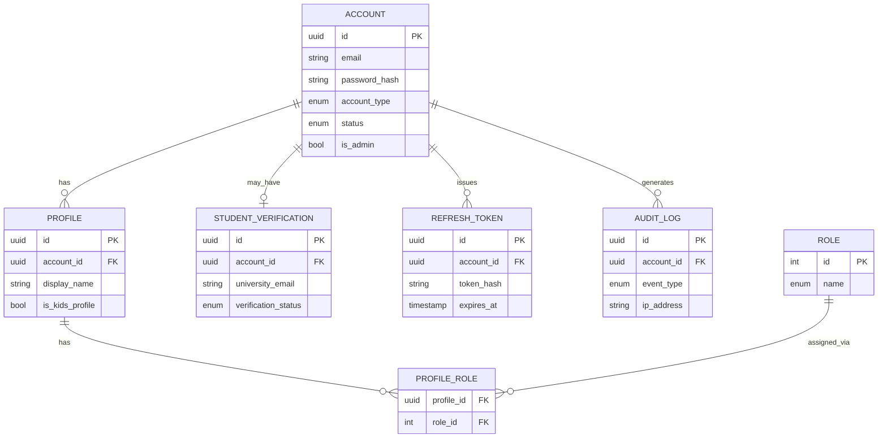

# 01 — Identity Domain

## Rôle dans l'architecture

Identity est le **service de vérité** pour "qui est cet utilisateur et qu'a-t-il le droit de faire". Tous les autres domaines (Billing, Delivery, Social) lui posent des questions plutôt que de dupliquer sa logique. C'est le premier candidat naturel pour un service gRPC interne, car il sera appelé très fréquemment par les autres services (ex: Delivery vérifie l'accès à chaque requête de lecture vidéo) et la latence y compte.

## Concepts clés à maîtriser ici

### 1. Authentication vs Authorization (ne pas les confondre)

- **Authentication** = "qui es-tu ?" → vérifier une identité (email/password, OAuth, etc.)
- **Authorization** = "as-tu le droit de faire X ?" → décider un accès en fonction de rôles/permissions

Beaucoup de bugs de sécurité viennent de cette confusion : un token JWT valide prouve *qui* tu es, pas *ce que tu peux faire*. L'autorisation doit être vérifiée séparément, à chaque action sensible.

### 2. Stratégie de session : JWT vs Session opaque

Deux approches courantes, avec des compromis différents :

| | JWT (stateless) | Session opaque (stateful) |
|---|---|---|
| Révocation immédiate | Difficile (le token reste valide jusqu'à expiration) | Facile (supprimer côté serveur) |
| Scalabilité horizontale | Facile (pas de lookup DB à chaque requête) | Nécessite un store partagé (Redis) |
| Taille de la requête | Plus lourd (token envoyé à chaque appel) | Léger (juste un ID de session) |

**Recommandation pour ce projet** : JWT à courte durée de vie (15 min) + refresh token opaque stocké en base (avec possibilité de révocation). C'est le pattern standard dans l'industrie et ça te permet d'apprendre les deux mécanismes.

### 3. Modèle d'autorisation : RBAC

RBAC (Role-Based Access Control) : chaque utilisateur a un ou plusieurs rôles, chaque rôle a des permissions. Suffisant pour ce projet — pas besoin d'ABAC (Attribute-Based) sauf si tu veux explorer plus tard des règles genre "un parent peut modérer le profil de son enfant sur un compte famille", ce qui est un bon terrain d'apprentissage si tu veux pousser plus loin.

**Rôle admin minimal** (ajouté au démarrage de Catalog, au-delà de la spec initiale) : `Account.is_admin`, un booléen plat, distinct du `RoleName` de profil (OWNER/MEMBER/KID, qui s'applique à un `Profile` au sein d'un compte, pas au compte lui-même). Sert uniquement à autoriser les écritures d'autres domaines (ex: `createTitle` côté Catalog) — pas de gestion fine de permissions type RBAC complet pour l'instant (YAGNI, à revoir si plusieurs niveaux d'admin deviennent nécessaires). Aucun chemin self-service ne le positionne à `true` : seule une écriture DB directe le fait, documentée dans `services/identity/README.md`. Embarqué dans le claim JWT à `Login`/`RefreshToken` plutôt que relu à chaque `ValidateToken` (l'appel le plus fréquent du système) — une promotion met donc jusqu'à `ACCESS_TOKEN_TTL_SECONDS` à prendre effet, pas immédiatement.

### 4. Comptes multi-types avec sous-profils (le vrai défi de ce domaine)

Le point intéressant de ta spec : un compte "famille" n'est pas juste un `account_type` sur `users` — c'est une relation **compte payeur → plusieurs profils**. Netflix et consorts modélisent ça ainsi :

```
Account (paie l'abonnement, a un plan)
  └── Profile (1..N) — chaque profil a son historique, ses recommandations, ses restrictions d'âge
        └── User credentials (optionnel : un profil peut avoir son propre login, ou hériter du compte)
```

- **perso** → 1 account, 1 profile
- **famille** → 1 account, N profiles (avec contrôle parental possible sur certains)
- **étudiant** → 1 account, 1 profile, mais avec vérification d'éligibilité (email universitaire, justificatif) et tarif réduit

Séparer `Account` et `Profile` dès le départ t'évite une migration douloureuse plus tard.

## Modèle de données

```
Account
- id (uuid, pk)
- email (unique, not null)
- password_hash (nullable si OAuth uniquement)
- account_type (enum: perso, famille, etudiant)
- status (enum: active, suspended, pending_verification)
- created_at, updated_at

StudentVerification  (uniquement si account_type = etudiant)
- id (uuid, pk)
- account_id (fk -> Account)
- university_email (nullable)
- verification_status (enum: pending, approved, rejected)
- verified_at (nullable)

Profile
- id (uuid, pk)
- account_id (fk -> Account)
- display_name
- avatar_url (nullable)
- is_kids_profile (boolean, default false)
- created_at

Role
- id (pk)
- name (enum: owner, member, kid)   -- "owner" = celui qui gère le compte (paiement, ajout de profils)

ProfileRole
- profile_id (fk -> Profile)
- role_id (fk -> Role)

RefreshToken
- id (uuid, pk)
- account_id (fk -> Account)
- token_hash (jamais stocker le token en clair)
- expires_at
- revoked_at (nullable)
- created_at

AuditLog  (bonne pratique dès le départ pour un service Identity)
- id (uuid, pk)
- account_id (fk -> Account, nullable si tentative échouée)
- event_type (enum: login_success, login_failed, password_reset, token_revoked, ...)
- ip_address
- created_at
```

**Pourquoi séparer `Role` et `ProfileRole` plutôt qu'un simple champ enum sur `Profile`** : ça permet à un profil d'avoir plusieurs rôles simultanément et surtout, ça se généralise proprement si tu ajoutes des rôles plus tard (ex: modérateur de commentaires côté Social) sans migration de schéma cassante.

## Schéma du modèle de données (ER)



## Contrat de service — gRPC

Puisque tu veux approfondir gRPC, voici comment structurer le `.proto`. Les points pédagogiques à observer :

- **Unary calls** pour les vérifications simples (`ValidateToken`)
- **Champs `optional`** en proto3 pour distinguer "valeur absente" de "valeur par défaut" (utile pour `student_verification`)
- **Codes d'erreur gRPC** (`NOT_FOUND`, `PERMISSION_DENIED`, `UNAUTHENTICATED`) plutôt que de tout faire remonter en `INTERNAL` — c'est ce qui permet aux services appelants de réagir correctement

Contrat réel, tenu à jour dans `/proto/identity.proto` (source de vérité — ce bloc en est une copie pour la lecture, ne pas laisser diverger) :

```protobuf
syntax = "proto3";
package identity.v1;

service IdentityService {
  // Ne crée jamais de session active : le compte est créé
  // PENDING_VERIFICATION et access_token/refresh_token reviennent vides
  // jusqu'à ce que VerifyEmail active le compte. Le caller doit lire
  // account.status, pas supposer un token non vide.
  rpc Register(RegisterRequest) returns (AuthResponse);

  // V1 mock uniquement : pas d'infra d'envoi d'email réelle, donc le token
  // de vérification est renvoyé directement dans
  // AuthResponse.email_verification_token au lieu d'être emailé.
  rpc VerifyEmail(VerifyEmailRequest) returns (AuthResponse);

  rpc Login(LoginRequest) returns (AuthResponse);

  // Rotation : l'ancien refresh token est révoqué, un nouveau couple est
  // émis. Présenter un token déjà révoqué = vol détecté → tous les refresh
  // tokens du compte sont révoqués et UNAUTHENTICATED est renvoyé.
  rpc RefreshToken(RefreshTokenRequest) returns (AuthResponse);
  rpc Logout(LogoutRequest) returns (LogoutResponse);

  // Appelé en interne par d'autres services (Delivery, Billing, Social)
  rpc ValidateToken(ValidateTokenRequest) returns (ValidateTokenResponse);
  rpc GetAccount(GetAccountRequest) returns (Account);

  // Le premier profil d'un compte reçoit toujours OWNER. PERSO/ETUDIANT
  // sont limités à un seul profil (FAILED_PRECONDITION sur un deuxième) ;
  // seul FAMILLE peut en créer plusieurs.
  rpc CreateProfile(CreateProfileRequest) returns (Profile);
  rpc ListProfiles(ListProfilesRequest) returns (ListProfilesResponse);
}

message RegisterRequest {
  string email = 1;
  string password = 2;
  AccountType account_type = 3;
  optional string university_email = 4; // requis seulement si account_type = ETUDIANT
}

enum AccountType {
  ACCOUNT_TYPE_UNSPECIFIED = 0;
  PERSO = 1;
  FAMILLE = 2;
  ETUDIANT = 3;
}

message AuthResponse {
  string access_token = 1;
  string refresh_token = 2;
  int64 expires_in = 3;
  Account account = 4;
  optional string email_verification_token = 5; // set uniquement par Register, cf. commentaire VerifyEmail
}

message ValidateTokenRequest {
  string access_token = 1;
}

message ValidateTokenResponse {
  bool valid = 1;
  string account_id = 2;
  bool is_admin = 3; // lu depuis le claim JWT, pas une lecture DB fraîche — cf. Account.is_admin ci-dessous
}

message Account {
  string id = 1;
  string email = 2;
  AccountType account_type = 3;
  string status = 4;
  bool is_admin = 5; // rôle admin minimal, cf. section 3 "Modèle d'autorisation : RBAC" plus haut
}

message VerifyEmailRequest { string token = 1; }
message GetAccountRequest { string account_id = 1; }
message LogoutRequest { string refresh_token = 1; }
message LogoutResponse { bool success = 1; }
message RefreshTokenRequest { string refresh_token = 1; }
message LoginRequest { string email = 1; string password = 2; }

message Profile {
  string id = 1;
  string account_id = 2;
  string display_name = 3;
  bool is_kids_profile = 4;
}
message CreateProfileRequest { string account_id = 1; string display_name = 2; bool is_kids_profile = 3; }
message ListProfilesRequest { string account_id = 1; }
message ListProfilesResponse { repeated Profile profiles = 1; }
```

**Pas encore implémenté** : `ValidateTokenResponse.roles` (RBAC par profil, exposer les rôles au caller) — `Role`/`ProfileRole` sont maintenant exploités par `CreateProfile` en interne, mais rien ne les expose encore côté `ValidateToken`.

**Point d'apprentissage important** : `ValidateToken` sera l'appel gRPC le plus fréquent de tout le système (chaque service appelle Identity avant chaque action protégée). C'est le bon endroit pour découvrir plus tard le **connection pooling** et le **client-side load balancing** de gRPC si tu veux pousser la partie perf.

## Bonnes pratiques sécurité à appliquer dès la Phase 1

- Hash des mots de passe avec **argon2id** (préféré à bcrypt aujourd'hui pour sa résistance GPU/ASIC) — jamais de hash maison
- Rate limiting sur `Login` et `Register` (protection brute-force) — implémenté (Redis, fenêtre fixe par IP, `services/identity/src/domain/rateLimiter.ts` + `infra/redisRateLimiter.ts`)
- Ne jamais stocker de refresh token en clair — hash-le comme un mot de passe
- Rotation de refresh token à chaque usage ("refresh token rotation") : détecte le vol de token si un ancien refresh token est réutilisé
- Vérification d'email obligatoire avant activation du compte (`status = pending_verification`)
- Validation de l'email universitaire pour `etudiant` : ne fais pas confiance à une simple regex `@*.edu` — prévoir un flux de vérification asynchrone (upload de justificatif ou service tiers), même mocké en V1

## Endpoints exposés au frontend (via une gateway devant les services gRPC)

Le frontend ne parle pas gRPC directement (pas de support natif navigateur sans gRPC-Web). Une **API Gateway** traduit les requêtes du client en appels gRPC internes.

**Décision de projet** : l'authentification et la gestion de compte sont exposées en **REST**, pas en GraphQL — voir `00-OVERVIEW.md`, "Les trois styles d'API", pour la justification (cookies `httpOnly` pour le refresh token). GraphQL reste réservé aux autres domaines (Catalog, Social, Discovery).

```
POST   /auth/register        { email, password, accountType, universityEmail? } -> AuthPayload (tokens vides si pending_verification, + emailVerificationToken mocké, cf. VerifyEmail)
POST   /auth/verify-email    { token }                                          -> { account } (active le compte)
POST   /auth/login           { email, password }                                -> AuthPayload
POST   /auth/refresh         (refresh token en cookie httpOnly)                  -> AuthPayload
POST   /auth/logout          (refresh token en cookie httpOnly)                  -> 204
GET    /auth/me                                                                  -> Account
GET    /auth/profiles                                                            -> Profile[]
POST   /auth/profiles        { displayName, isKidsProfile }                      -> Profile
```

Chaque route REST de la Gateway ne contient aucune logique métier : elle valide la forme de la requête HTTP, appelle le RPC gRPC correspondant sur `IdentityService` (`Register`, `Login`, `RefreshToken`, `Logout`, `GetAccount`, `ListProfiles`, `CreateProfile`), pose/lit les cookies, et retourne le résultat. Le contrat gRPC ci-dessus ne change pas.

## État d'avancement de ce fichier

- [x] Choisir la lib JWT (`jose`, `services/identity/src/domain/tokens.ts`)
- [x] Définir le schéma DB (PostgreSQL, via Prisma — `services/identity/prisma/schema.prisma`)
- [x] Générer le stub gRPC (`@grpc/grpc-js` + `ts-proto`, `services/identity/src/grpc/generated`)
- [x] Implémenter Register/VerifyEmail/Login/RefreshToken/Logout/ValidateToken/GetAccount/CreateProfile/ListProfiles — surface complète du domaine
- [x] Rate limiting Redis sur Login/Register
- [ ] Gateway GraphQL (Catalog/Social/Discovery, pas encore construits — l'auth passe par REST, cf. section ci-dessus)

## Prochaine étape

`03-catalog.md` — modèle de données du catalogue (films, séries, saisons, épisodes, shorts) et comment il s'articule avec Identity (profils kids → filtrage de contenu).
