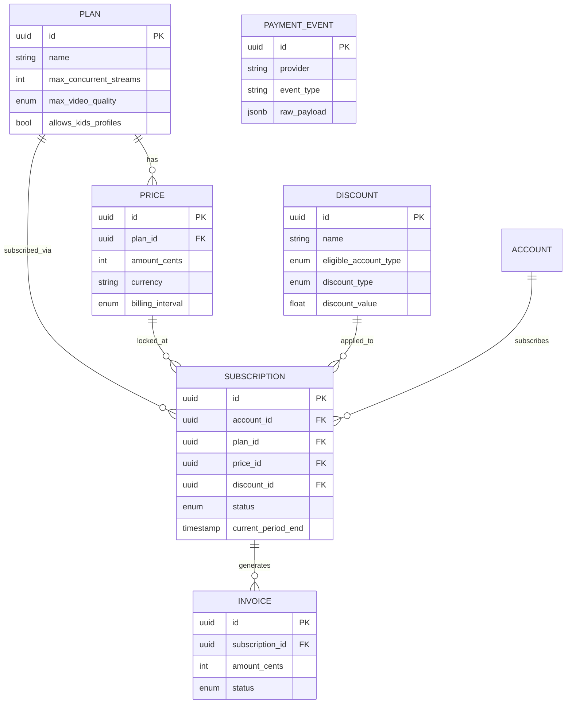

# 02 — Billing Domain

## Rôle dans l'architecture

Billing gère les plans d'abonnement, leur tarification (avec réductions selon le type de compte), et le cycle de vie de l'abonnement (essai, actif, expiré, annulé). C'est le domaine où la rigueur transactionnelle compte le plus : une erreur ici a un impact financier direct.

## Concepts clés

### 1. Découpler Plan, Price et Subscription

Erreur fréquente de modélisation : mettre le prix directement sur le plan et le muter quand le tarif change. Résultat : tous les abonnés existants voient leur historique de facturation changer rétroactivement. Il faut séparer :

- **Plan** : ce que le plan offre (nombre d'écrans simultanés, qualité max, catalogue kids ou non) — change rarement
- **Price** : un tarif associé à un plan, versionné dans le temps — un plan peut avoir plusieurs prix historiques
- **Subscription** : l'instance active d'un compte sur un plan, à un prix figé au moment de la souscription

### 2. Réductions par type de compte : règle ou entité ?

Ta spec demande des réductions selon `account_type` (famille, étudiant). Deux approches :
- **Règle codée en dur** (`if account_type == 'etudiant': price * 0.5`) — rapide mais rigide, mauvaise pratique dès que tu veux plusieurs types de réduction (promo temporaire, réduction cumulable, etc.)
- **Table `Discount`** avec règles d'éligibilité et type de réduction (pourcentage ou montant fixe) — plus de travail initial, mais bonne pratique standard en billing et facilement extensible (codes promo plus tard, par exemple)

**Recommandation** : table `Discount`, même pour V1. Le domaine billing est justement celui où "je rajouterai ça proprement plus tard" coûte cher en dette technique.

### 3. Cycle de vie d'un abonnement (état à modéliser explicitement)

```
trialing → active → past_due → canceled
              ↑___________|
           (paiement réussi après échec)
```

- `trialing` : période d'essai, pas encore facturé
- `active` : abonnement payant en cours
- `past_due` : paiement échoué, grace period avant coupure d'accès
- `canceled` : résilié (par l'utilisateur ou après échecs répétés)

Ne jamais supprimer un abonnement annulé — le passer à `canceled` et garder l'historique (nécessaire pour l'audit et pour "se réabonner" plus tard).

### 4. Intégration paiement réel vs mock

Pour apprendre le domaine sans dépendre d'un vrai compte marchand dès le départ, Stripe en **mode test** est recommandé : API réaliste, webhooks réels, mais aucune vraie transaction. Tu apprends le vrai flux (webhooks de paiement, gestion des échecs) sans friction administrative.

## Modèle de données

```
Plan
- id (uuid, pk)
- name (ex: "Basique", "Standard", "Premium")
- max_concurrent_streams
- max_video_quality (enum: SD, HD, UHD)
- allows_kids_profiles (boolean)
- is_active (boolean)  -- un plan retiré de la vente reste visible pour ceux qui l'ont déjà

Price
- id (uuid, pk)
- plan_id (fk -> Plan)
- amount_cents
- currency (ex: XOF, EUR, USD)
- billing_interval (enum: monthly, yearly)
- valid_from
- valid_until (nullable = toujours valide)

Discount
- id (uuid, pk)
- name (ex: "Réduction étudiant")
- eligible_account_type (enum: etudiant, famille, nullable = tous)
- discount_type (enum: percentage, fixed_amount)
- discount_value
- requires_verification (boolean)  -- true pour étudiant (cf. StudentVerification dans Identity)

Subscription
- id (uuid, pk)
- account_id (fk -> Identity.Account)
- plan_id (fk -> Plan)
- price_id (fk -> Price)  -- prix figé au moment de la souscription
- discount_id (fk -> Discount, nullable)
- status (enum: trialing, active, past_due, canceled)
- current_period_start
- current_period_end
- canceled_at (nullable)
- created_at

Invoice
- id (uuid, pk)
- subscription_id (fk -> Subscription)
- amount_cents
- status (enum: paid, failed, pending)
- payment_provider_ref (ex: Stripe invoice ID)
- issued_at
- paid_at (nullable)

PaymentEvent  (log brut des webhooks reçus, pour audit et debug)
- id (uuid, pk)
- provider (ex: stripe)
- event_type
- raw_payload (jsonb)
- processed_at
- received_at
```

## Schéma du modèle de données (ER)



## Contrat de service — gRPC

```protobuf
syntax = "proto3";
package billing.v1;

service BillingService {
  rpc Subscribe(SubscribeRequest) returns (Subscription);
  rpc CancelSubscription(CancelSubscriptionRequest) returns (Subscription);
  rpc GetActiveSubscription(GetActiveSubscriptionRequest) returns (Subscription);

  // Appelé par Delivery à chaque contrôle d'accès
  rpc IsSubscriptionActive(IsSubscriptionActiveRequest) returns (IsSubscriptionActiveResponse);
}

message SubscribeRequest {
  string account_id = 1;
  string plan_id = 2;
  optional string discount_code = 3;
}

message Subscription {
  string id = 1;
  string plan_id = 2;
  string status = 3;
  int64 current_period_end_unix = 4;
}

message IsSubscriptionActiveRequest { string account_id = 1; }
message IsSubscriptionActiveResponse {
  bool active = 1;
  int32 max_concurrent_streams = 2;
  string max_video_quality = 3;
}

message CancelSubscriptionRequest { string account_id = 1; }
message GetActiveSubscriptionRequest { string account_id = 1; }
```

**Point d'apprentissage** : `IsSubscriptionActive` sera appelé par Delivery à haute fréquence (à chaque `CheckAccess`) — bon candidat pour introduire un **cache court** (quelques secondes, Redis) côté Delivery afin de ne pas taper Billing à chaque segment vidéo demandé, tout en gardant une fraîcheur acceptable.

## Bonnes pratiques

- **Idempotency keys** sur les opérations de paiement — un retry réseau ne doit jamais créer deux facturations pour la même intention de paiement (Stripe supporte ça nativement)
- **Vérification de signature de webhook** (Stripe signe ses webhooks) — sans ça, n'importe qui peut forger un faux événement "paiement réussi"
- **Ne jamais faire confiance au client pour le prix** : le prix est toujours recalculé côté serveur à partir de `Plan` + `Discount`, jamais transmis par le frontend
- **Grace period sur `past_due`** avant coupure d'accès (ex: 3 jours) — meilleure expérience utilisateur qu'une coupure immédiate sur un échec de paiement transitoire (carte expirée le jour même, etc.)
- **Réconciliation périodique** : un job planifié qui compare l'état local des abonnements avec l'état chez le provider de paiement, pour détecter les désynchronisations (webhook manqué, etc.)
- **Audit trail complet** : `PaymentEvent` garde tous les événements bruts reçus, même ceux non traités avec succès — essentiel pour débugger un litige de facturation des mois plus tard

## État d'avancement

- [ ] Schéma DB (Plan, Price, Discount, Subscription, Invoice, PaymentEvent)
- [ ] Intégration Stripe en mode test + webhooks
- [ ] `IsSubscriptionActive` avec cache court côté Delivery
- [ ] Job de réconciliation périodique

## Prochaine étape

`06-social.md` — commentaires, likes/dislikes, partage, recommandation entre utilisateurs.
