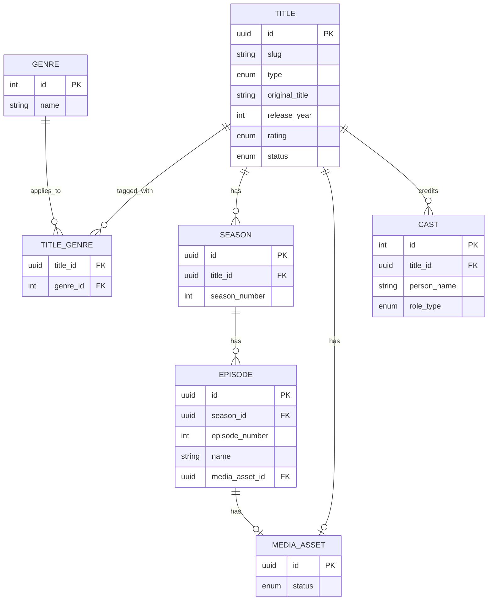

# 03 — Catalog Domain

## Rôle dans l'architecture

Catalog détient toutes les métadonnées de contenu — pas les fichiers vidéo eux-mêmes (ça, c'est Media Pipeline/Delivery). C'est le domaine le plus "CRUD classique" du projet, mais il porte deux responsabilités qui méritent d'être bien pensées dès le départ : la **hiérarchie de contenu** (film / série / saison / épisode / short) et le **filtrage par âge** en lien avec les profils kids d'Identity.

## Concepts clés

### 1. Modèle polymorphe vs tables séparées

Deux façons de modéliser "du contenu regardable" :
- **Table unique polymorphe** (`content` avec un champ `type`) — simple mais mène à des colonnes nullable partout (`season_number` n'a de sens que pour un épisode)
- **Tables séparées avec table commune** (`Title` générique + `Movie`, `Series`, `Short` spécifiques) — plus de tables, mais chaque table reste propre

**Recommandation** : table commune `Title` (métadonnées partagées : titre, synopsis, année, genres, rating) + tables spécifiques pour ce qui diverge. Une série a des saisons/épisodes, un film et un short sont "à plat". C'est le modèle qu'utilisent la plupart des plateformes VOD en production.

### 2. Content rating et filtrage kids

Chaque `Title` a un rating (ex: système type MPAA : G, PG, PG-13, R — ou un système simplifié maison). Le profil kids (`Profile.is_kids_profile` défini dans Identity) filtre le catalogue exposé : c'est une règle appliquée **côté gateway/API**, jamais côté client uniquement (sinon contournable).

### 3. Slugs et identifiants stables

Utilise un `slug` (ex: `the-matrix-1999`) en plus de l'UUID pour les URLs publiques — meilleur pour le SEO et la lisibilité, et ça découple l'URL de l'ID interne.

## Modèle de données

```
Title
- id (uuid, pk)
- slug (unique)
- type (enum: movie, series, short)
- original_title
- synopsis
- release_year
- rating (enum: G, PG, PG_13, R, NC_17, UNRATED)
- runtime_minutes (nullable pour series, applicable pour movie/short)
- poster_url, backdrop_url
- status (enum: draft, published, archived)
- created_at, updated_at

Genre
- id (pk), name (unique)

TitleGenre  (many-to-many)
- title_id (fk -> Title)
- genre_id (fk -> Genre)

Season   (uniquement si Title.type = series)
- id (uuid, pk)
- title_id (fk -> Title)
- season_number
- synopsis (nullable)

Episode
- id (uuid, pk)
- season_id (fk -> Season)
- episode_number
- name
- synopsis
- runtime_minutes
- media_asset_id (fk -> MediaAsset, nullable tant que non transcodé — cf. 04-media-pipeline)

MediaAsset  (référence vers le pipeline média, un par Movie/Short/Episode)
- id (uuid, pk)
- title_id (fk -> Title, nullable)
- episode_id (fk -> Episode, nullable)
- status (enum: pending_upload, processing, ready, failed)
-- Détails complets dans 04-media-pipeline.md

Cast  (optionnel V1, bon exercice de modélisation many-to-many avec attributs)
- id (pk)
- title_id (fk -> Title)
- person_name
- role_name  (ex: "Neo", ou "Director")
- role_type (enum: actor, director, writer)
```

**Contrainte à valider en base** : `season_id` obligatoire uniquement si le `Title` parent est de type `series` — à imposer via une contrainte applicative (pas facilement en `CHECK` SQL cross-table), documente ce choix explicitement dans le code.

## Schéma du modèle de données (ER)



## Recherche et indexation

Pour la recherche full-text (titre, synopsis, acteurs), deux options :
- **PostgreSQL full-text search** (`tsvector`) — suffisant pour V1, pas de dépendance supplémentaire, bon exercice pour approfondir PostgreSQL au-delà des contraintes déjà explorées
- **Elasticsearch/Meilisearch** — si tu veux explorer un moteur de recherche dédié plus tard (facettes par genre, tolérance aux fautes de frappe)

**Recommandation V1** : PostgreSQL `tsvector` + index GIN. Tu upgrades vers un moteur dédié seulement si le besoin se manifeste (YAGNI appliqué).

## Contrat API — GraphQL

Catalog est un bon candidat pour être exposé **directement en GraphQL** côté client (par opposition à REST, contrairement à Identity — cf. `docs/00-OVERVIEW.md`, "Les trois styles d'API") car c'est un domaine read-heavy. Le GraphQL est hébergé par la **Gateway** (seul point d'entrée client, `services/gateway/src/graphql/`), qui appelle `CatalogService` en gRPC interne — même schéma que pour Identity/REST, pas de couche supplémentaire au-delà de ce qui existe déjà.

**Implémenté** (`services/gateway/src/graphql/schema.ts`, source de vérité pour ce qui est réellement exposé aujourd'hui) : `type Title` (sans `seasons`, avec `isPlayable`/`videoUrl` en plus — dérivés du `MediaAsset`, absents de la cible ci-dessous puisqu'elle les place sur `Episode` — et `genres` en `[String!]!` plutôt que `[Genre!]!`, cf. plus bas), `Query.title(slug)`, `Mutation.createTitle`/`attachMediaAsset`/`publishTitle`. Le bloc ci-dessous est le schéma **cible** complet de la spec — `browseTitles`/`searchTitles`, `Season`/`Episode`, et le filtrage kids restent à construire.

```graphql
type Title {
  id: ID!
  slug: String!
  type: TitleType!
  originalTitle: String!
  synopsis: String!
  releaseYear: Int!
  rating: ContentRating!
  genres: [Genre!]!
  posterUrl: String
  seasons: [Season!]  # null si type != SERIES
}

type Season {
  id: ID!
  seasonNumber: Int!
  episodes: [Episode!]!
}

type Episode {
  id: ID!
  episodeNumber: Int!
  name: String!
  runtimeMinutes: Int!
  isPlayable: Boolean!   # dérivé du statut du MediaAsset
}

type Query {
  title(slug: String!): Title
  browseTitles(genre: String, type: TitleType, page: Int, pageSize: Int): TitleConnection!
  searchTitles(query: String!): [Title!]!
}
```

**Filtrage kids** : le resolver `browseTitles`/`searchTitles` doit recevoir le profil actif (extrait du token validé via Identity) et exclure automatiquement les ratings inadaptés — logique centralisée dans un seul resolver middleware, jamais dupliquée.

**Genre implémenté différemment de la cible ci-dessus** : `Title.genres` est en `[String!]!` (des noms) plutôt qu'en `[Genre!]!` — rien ne cherche encore un titre par id de genre, donc exposer un id serait de la complexité sans usage. `CreateTitle` upserte chaque nom à la volée (`connectOrCreate`), pas de mutation séparée pour gérer le référentiel de genres.

## Bonnes pratiques

- **Statut `draft`/`published`** dès le départ : jamais exposer un contenu dont le `MediaAsset` n'est pas `ready`, même si les métadonnées existent déjà (évite d'afficher un titre non lisible)
- **Pagination par curseur** (cursor-based) plutôt que offset/limit pour `browseTitles` — plus robuste si le catalogue grossit et évite les doublons/sauts lors du scroll infini
- **Cache applicatif** (Redis) sur `title(slug)` — contenu peu volatile, forte fréquence de lecture, cas d'usage classique de cache-aside
- **Versioning des métadonnées** : si tu corriges un synopsis après publication, garder un historique simple (`updated_at` suffit en V1, table d'audit si tu veux approfondir plus tard)
- **i18n dès le modèle** si tu veux explorer le sujet : `synopsis`/`name` pourraient être des tables de traduction (`TitleTranslation` par langue) plutôt que des colonnes simples — à évaluer selon ton appétit d'apprentissage sur ce point précis

## État d'avancement

- [x] Schéma DB PostgreSQL — `Title` + `MediaAsset` (un par titre, V1 statique) + `Genre`/`TitleGenre` (`CreateTitle`/`GetTitleBySlug`/`AttachMediaAsset`/`PublishTitle` gRPC, `services/catalog/`) ; Season/Episode restent à faire, features séparées
- [ ] Index GIN full-text search
- [x] Resolvers GraphQL — `Query.title(slug)`/`Mutation.createTitle` (`services/gateway/src/graphql/`) ; filtrage kids pas encore applicable (pas de profils actifs dans le contexte GraphQL pour l'instant, à ajouter avec `browseTitles`/`searchTitles`)
- [x] **Un titre peut réellement devenir regardable** (`docs/00-OVERVIEW.md`, objectif Phase 1 : "lecture d'un fichier vidéo statique unique, pas encore de transcodage") — `AttachMediaAsset` associe une URL statique, `PublishTitle` refuse tant qu'elle n'est pas `READY`
- [ ] Seed de données de test (quelques films/séries fictifs pour développer sans dépendre du pipeline média)

**Note d'implémentation (au-delà de la spec initiale)** : `CreateTitle`/`GetTitleBySlug`/`AttachMediaAsset`/`PublishTitle` sont exposés en **gRPC interne** (`CatalogService`, `/proto/catalog.proto`), pas directement en GraphQL — la Gateway reste le seul point d'entrée client (`docs/00-OVERVIEW.md`), elle héberge le serveur GraphQL (`services/gateway/src/graphql/`) et appelle Catalog en gRPC, exactement comme pour Identity/REST. La section "Contrat API — GraphQL" ci-dessous est la cible côté client ; `browseTitles`/`searchTitles` et le filtrage kids centralisé viendront avec la pagination et les profils actifs (voir `services/gateway/README.md` pour l'état exact des resolvers implémentés).

## Prochaine étape

`04-media-pipeline.md` — upload, transcodage, stockage : le domaine le plus technique du projet.
