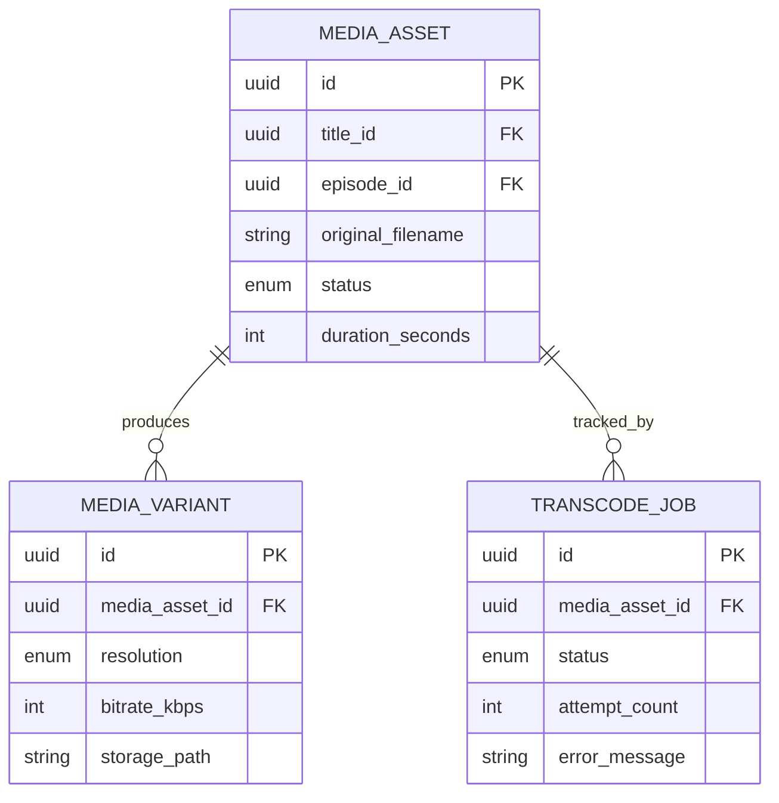

# 04 — Media Pipeline Domain

## Rôle dans l'architecture

Le domaine le plus technique du projet. Responsable de transformer un fichier vidéo brut uploadé en un ensemble de fichiers segmentés, multi-résolutions, prêts à être servis en streaming adaptatif. Isolé en service séparé car : (1) charge CPU très différente du reste (transcodage = calcul intensif, pas de la logique métier légère), (2) doit scaler indépendamment (tu veux pouvoir ajouter des workers de transcodage sans toucher au reste), (3) traitement intrinsèquement asynchrone.

## Concepts clés

### 1. Pourquoi l'upload direct n'est pas suffisant

Un upload naïf (`POST /upload` avec le fichier entier en body) pose plusieurs problèmes en production : timeout sur gros fichiers, pas de reprise en cas de coupure réseau, charge le serveur applicatif avec du transfert de fichier volumineux.

**Pattern recommandé : upload direct vers stockage objet via URL pré-signée**
1. Le client demande une URL d'upload au backend (`POST /media/initiate-upload`)
2. Le backend génère une **presigned URL** S3-compatible (durée de vie limitée)
3. Le client upload directement vers le stockage objet (pas via ton serveur applicatif)
4. Le stockage objet notifie ton backend via webhook/event que l'upload est terminé
5. Un job de transcodage est déclenché

Ça évite de faire transiter des gigaoctets de vidéo par ton serveur Node.js.

### 2. Transcodage et adaptive bitrate

Un même contenu doit être disponible en plusieurs qualités pour que le lecteur adapte le débit à la bande passante du spectateur (adaptive bitrate streaming). Ladder de résolutions classique :

| Résolution | Bitrate vidéo approx. | Usage |
|---|---|---|
| 1080p | ~5 Mbps | Bonne connexion |
| 720p | ~2.5 Mbps | Connexion moyenne |
| 480p | ~1 Mbps | Connexion faible/mobile |

`ffmpeg` reste l'outil standard pour ça, quel que soit le langage backend. Chaque résolution est encodée séparément puis segmentée.

### 3. HLS (HTTP Live Streaming) — format recommandé pour V1

HLS découpe la vidéo en segments (`.ts` ou fMP4, ~6-10 secondes chacun) + un fichier manifest (`.m3u8`) qui liste les segments et les qualités disponibles. C'est le format le plus largement supporté (natif sur Safari/iOS, `hls.js` partout ailleurs) — préférable à DASH pour un premier projet, tu pourras ajouter DASH plus tard si tu veux comparer les deux (bon sujet d'apprentissage additionnel).

Structure de sortie typique :
```
/media/{asset_id}/
  master.m3u8          <- manifest principal, référence les variantes
  1080p/
    playlist.m3u8
    segment_000.ts
    segment_001.ts ...
  720p/
    playlist.m3u8
    segment_000.ts ...
  480p/
    playlist.m3u8 ...
```

### 4. Traitement asynchrone : job queue

Le transcodage prend du temps (minutes, pas millisecondes) — ça ne peut pas être une requête HTTP synchrone. Architecture recommandée :

```
Upload terminé → événement publié → Job Queue (BullMQ + Redis) → Worker(s) de transcodage
```

**Pourquoi BullMQ/Redis plutôt qu'une simple table `jobs` en DB** : gestion native des retries avec backoff, priorités, concurrence contrôlée, et visibilité (dashboard) — tu évites de réinventer une queue à la main. C'est un bon complément à ce que tu as déjà appris sur les DBMS : ici, Redis n'est pas une base de données relationnelle, c'est un outil de coordination.

## Modèle de données

```
MediaAsset
- id (uuid, pk)
- title_id (fk -> Title, nullable)
- episode_id (fk -> Episode, nullable)
- original_filename
- original_size_bytes
- status (enum: pending_upload, uploaded, processing, ready, failed)
- duration_seconds (rempli après transcodage)
- created_at, updated_at

MediaVariant   (une par résolution disponible, une fois le transcodage terminé)
- id (uuid, pk)
- media_asset_id (fk -> MediaAsset)
- resolution (enum: 480p, 720p, 1080p)
- bitrate_kbps
- storage_path
- created_at

TranscodeJob
- id (uuid, pk)
- media_asset_id (fk -> MediaAsset)
- status (enum: queued, running, completed, failed)
- attempt_count
- error_message (nullable)
- started_at, completed_at
```

## Schéma du modèle de données (ER)



## Contrat de service — gRPC

```protobuf
syntax = "proto3";
package media.v1;

service MediaService {
  rpc InitiateUpload(InitiateUploadRequest) returns (InitiateUploadResponse);
  rpc ConfirmUpload(ConfirmUploadRequest) returns (MediaAsset);
  rpc GetAssetStatus(GetAssetStatusRequest) returns (MediaAsset);

  // Server streaming : utile pour observer la progression du transcodage en temps réel
  rpc WatchTranscodeProgress(WatchTranscodeProgressRequest) returns (stream TranscodeProgressUpdate);
}

message InitiateUploadRequest {
  string filename;
  int64 size_bytes;
  string content_owner_type; // "title" ou "episode"
  string content_owner_id;
}

message InitiateUploadResponse {
  string media_asset_id = 1;
  string presigned_upload_url = 2;
  int64 expires_in_seconds = 3;
}

message ConfirmUploadRequest { string media_asset_id = 1; }

message GetAssetStatusRequest { string media_asset_id = 1; }

message MediaAsset {
  string id = 1;
  string status = 2;
  int32 duration_seconds = 3;
  repeated MediaVariant variants = 4;
}

message MediaVariant {
  string resolution = 1;
  int32 bitrate_kbps = 2;
}

message WatchTranscodeProgressRequest { string media_asset_id = 1; }

message TranscodeProgressUpdate {
  string media_asset_id = 1;
  int32 percent_complete = 2;
  string current_stage = 3; // "downloading", "encoding_1080p", "packaging_hls"...
}
```

**Point d'apprentissage important** : `WatchTranscodeProgress` est ton premier cas d'usage naturel de **server streaming gRPC** dans ce projet (contrairement à Identity qui n'utilisera que du unary) — bon complément direct à ce que tu as déjà exploré dans `grpc-example/`.

## Bonnes pratiques

- **Idempotence des jobs** : un job de transcodage relancé après crash ne doit pas dupliquer le travail — vérifier l'état avant de ré-exécuter, ou faire en sorte que l'opération soit naturellement idempotente (écraser le fichier de sortie au même chemin)
- **Retry avec backoff exponentiel + jitter** sur les jobs échoués — tu as déjà documenté ce compromis (latence vs fiabilité) dans tes findings MySQL, le principe s'applique identiquement ici
- **Dead-letter queue** : après N échecs, sortir le job de la queue active et l'isoler pour investigation manuelle plutôt que de le relancer indéfiniment
- **Validation du fichier avant transcodage** : vérifier le type MIME réel (pas juste l'extension), la durée, la résolution source — rejeter tôt plutôt que de lancer un job voué à l'échec
- **Scan antivirus/malware** sur les fichiers uploadés avant traitement, même en V1 basique (ClamAV) — un service qui accepte des uploads publics est une surface d'attaque
- **Checksum (SHA-256)** de l'original stocké, pour détecter la corruption
- **Nettoyage du fichier source** après transcodage réussi (ou déplacement vers stockage froid) — ne garde pas indéfiniment le master brut sur du stockage chaud coûteux
- **Monitoring des workers** : temps moyen de transcodage, taux d'échec, longueur de la queue — métriques à exposer dès le départ (Prometheus si tu veux explorer l'observabilité)

## Choix de stockage objet

**MinIO** (S3-compatible, self-hostable) est recommandé pour développer localement/sur ton serveur Ubuntu (cf. ton home-server) — API identique à S3 donc migration facile vers AWS S3/Cloudflare R2 si tu déploies plus tard. Bon complément à ton infra Tailscale/Ubuntu déjà en place.

## État d'avancement

- [ ] MinIO en local (docker-compose)
- [ ] Presigned URL upload flow
- [ ] Worker ffmpeg + BullMQ (encodage single-resolution d'abord, puis ladder complet)
- [ ] Packaging HLS (`ffmpeg -f hls`)
- [ ] gRPC service avec `WatchTranscodeProgress` en streaming

## Prochaine étape

`05-delivery.md` — servir les manifests HLS et contrôler l'accès au contenu selon l'abonnement.
