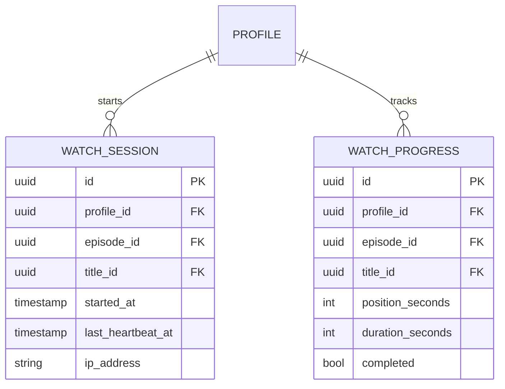

# 05 — Delivery Domain

## Rôle dans l'architecture

Delivery sert les fichiers HLS produits par Media Pipeline et **contrôle qui a le droit de les regarder maintenant**. C'est le point de jonction entre Identity (qui es-tu), Billing (as-tu un abonnement actif), Catalog (ce contenu existe-t-il) et Media Pipeline (le fichier est-il prêt). C'est le domaine où le contrôle d'accès doit être le plus rigoureux : c'est ici que "quelqu'un regarde gratuitement sans payer" se produirait si mal implémenté.

## Concepts clés

### 1. Pourquoi ne pas juste servir les fichiers statiquement

Si `master.m3u8` et les segments `.ts` sont accessibles par une URL publique fixe, n'importe qui ayant l'URL peut la partager et contourner l'abonnement. Il faut un **contrôle d'accès par requête**, pas juste au moment du clic "play".

### 2. Signed URLs à durée de vie courte

Pattern standard : chaque segment vidéo est servi via une URL signée (avec expiration, ex: 5-10 minutes) plutôt qu'une URL permanente. Le lecteur vidéo redemande une nouvelle URL signée périodiquement pendant la lecture.

```
Client → GET /delivery/{episode_id}/manifest
       → Delivery vérifie : token valide (Identity) + abonnement actif (Billing) + contenu ready (Catalog/Media)
       → Retourne un master.m3u8 dont les URLs de segments sont signées
```

### 3. DRM — à mentionner mais pas nécessaire en V1

Les vraies plateformes (Netflix, etc.) utilisent du DRM (Widevine, FairPlay) pour chiffrer le flux et empêcher l'extraction même avec l'URL en main. C'est un sujet avancé et complexe (licence serveur, clés de chiffrement par segment) — **hors scope V1**, à noter comme piste d'apprentissage future si tu veux aller très loin sur ce projet.

### 4. Suivi de la progression de visionnage

Nécessaire pour "reprendre où j'en étais" — fonctionnalité attendue sur ce type de plateforme, et donnée précieuse pour le domaine Discovery (07) plus tard.

## Modèle de données

```
WatchSession
- id (uuid, pk)
- profile_id (fk -> Identity.Profile)
- episode_id (fk -> Catalog.Episode, nullable)
- title_id (fk -> Catalog.Title, nullable)  -- l'un des deux selon le type de contenu
- started_at
- last_heartbeat_at
- ip_address
- device_info (nullable)

WatchProgress
- id (uuid, pk)
- profile_id (fk -> Profile)
- episode_id / title_id (comme WatchSession)
- position_seconds
- duration_seconds
- completed (boolean)  -- ex: > 90% regardé
- updated_at
  UNIQUE(profile_id, episode_id)  -- une seule ligne de progression par profil/contenu, mise à jour (upsert)
```

## Schéma du modèle de données (ER)



## Contrat de service — gRPC (interne) + REST/HTTP (pour le lecteur vidéo)

Delivery expose deux interfaces différentes selon le consommateur :
- **gRPC interne** pour la vérification d'accès (appelé par la gateway)
- **HTTP simple** pour servir les manifests/segments (le lecteur vidéo HLS parle HTTP, pas gRPC)

```protobuf
syntax = "proto3";
package delivery.v1;

service DeliveryService {
  rpc CheckAccess(CheckAccessRequest) returns (CheckAccessResponse);
  rpc RecordProgress(RecordProgressRequest) returns (RecordProgressResponse);
  rpc GetProgress(GetProgressRequest) returns (WatchProgress);
}

message CheckAccessRequest {
  string profile_id = 1;
  string content_id = 2; // title_id ou episode_id
}

message CheckAccessResponse {
  bool allowed = 1;
  string reason = 2; // "OK", "SUBSCRIPTION_EXPIRED", "CONTENT_NOT_READY", "AGE_RESTRICTED"
  string manifest_url = 3; // rempli seulement si allowed = true
}

message RecordProgressRequest {
  string profile_id = 1;
  string content_id = 2;
  int32 position_seconds = 3;
  int32 duration_seconds = 4;
}

message RecordProgressResponse { bool success = 1; }

message GetProgressRequest {
  string profile_id = 1;
  string content_id = 2;
}

message WatchProgress {
  int32 position_seconds = 1;
  int32 duration_seconds = 2;
  bool completed = 3;
}
```

**Endpoint HTTP séparé** (pas gRPC) pour le manifest réel :
```
GET /delivery/manifest/{content_id}?token={short_lived_signed_token}
→ 200: renvoie le master.m3u8 avec URLs de segments signées
→ 403: accès refusé (abonnement expiré, contenu restreint, etc.)
```

Le `token` court-terme est obtenu via l'appel gRPC `CheckAccess`, pas généré côté client.

## Bonnes pratiques

- **Vérification d'accès à chaque requête de manifest**, pas seulement au clic initial "play" — un abonnement peut expirer en cours de visionnage
- **Rate limiting par profil** sur les requêtes de manifest — empêche le partage massif de credentials (un même compte streamant depuis 50 IP différentes simultanément est un signal à surveiller, même en V1 basique sous forme de log/alerte plutôt que blocage automatique)
- **Heartbeat de session** : le client envoie un signal périodique (`RecordProgress` toutes les 15-30s) — permet de détecter les sessions abandonnées et de limiter le nombre de streams concurrents par compte (utile pour la logique "famille" : combien d'écrans simultanés autorisés ?)
- **Filtrage d'âge appliqué ici aussi**, pas seulement dans Catalog — défense en profondeur : même si un client contourne le filtrage du catalogue affiché, `CheckAccess` doit re-vérifier `is_kids_profile` vs `rating` avant d'autoriser la lecture
- **Logs d'accès détaillés** (qui, quoi, quand, résultat) — indispensables pour audit et pour debug des litiges "je n'arrive pas à regarder"

## État d'avancement

- [ ] Serveur HTTP de manifests avec signature d'URL (ex: signature HMAC + expiration)
- [ ] gRPC `CheckAccess` orchestrant Identity + Billing + Catalog + Media
- [ ] `RecordProgress`/`GetProgress` avec upsert
- [ ] Logs d'accès structurés

## Prochaine étape

`02-billing.md` — plans d'abonnement, réductions par type de compte, cycle de vie.
