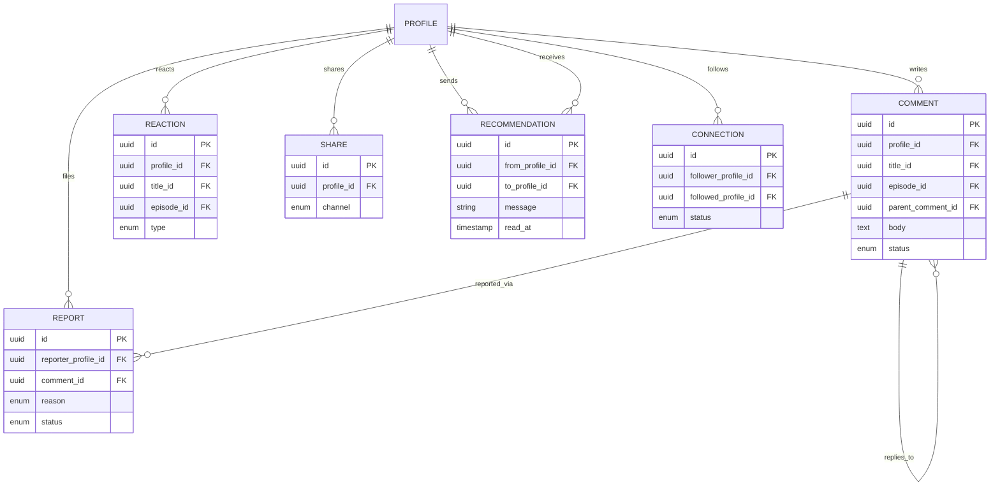

# 06 — Social Domain

## Rôle dans l'architecture

Social gère les interactions entre profils autour d'un contenu : commentaires, like/dislike, partage, recommandation directe à un autre utilisateur. Contrairement à Identity/Billing, c'est un domaine où le volume d'écriture peut être élevé (chaque like est une écriture) et où la modération devient vite nécessaire dès qu'il y a du texte libre public.

## Concepts clés

### 1. Le "graphe social" minimal nécessaire

Pour "recommander un film à un ami" et pour la proximité sociale utilisée par Discovery (07), il faut une notion de **relation entre profils** — un système de "follow" ou "ami" simple suffit en V1 :

```
Connection
- id (uuid, pk)
- follower_profile_id (fk -> Profile)
- followed_profile_id (fk -> Profile)
- status (enum: pending, accepted)   -- si tu veux un modèle "ami" bidirectionnel avec confirmation
- created_at
```

**Follow asymétrique (comme Twitter) vs amitié symétrique (comme Facebook)** : un follow asymétrique est plus simple à implémenter (pas de confirmation nécessaire) et suffit pour "suggestions basées sur des utilisateurs proches". Recommandé pour V1 — le modèle d'amitié bidirectionnelle est une extension possible plus tard si tu veux explorer la complexité d'un vrai graphe social.

### 2. Like/Dislike : compteur dénormalisé ou calcul à la volée ?

Sur un contenu populaire, compter les likes en temps réel (`COUNT(*) FROM reactions WHERE ...`) à chaque affichage devient coûteux. Pattern standard : **dénormaliser un compteur** sur `Title`/`Episode`, mis à jour de façon incrémentale.

```
-- Au moment du like :
UPDATE titles SET like_count = like_count + 1 WHERE id = ?
INSERT INTO reactions (...) 
```

Ça introduit un risque de désynchronisation (compteur qui dérive du réel) — accepter ce compromis en V1, et prévoir un job de réconciliation périodique (`recompute_counters`) comme filet de sécurité. C'est un bon terrain pour apprendre le compromis cohérence forte vs performance, dans la continuité de ce que tu as déjà observé sur les locks MySQL.

### 3. Modération — nécessaire dès qu'il y a du texte libre

Un système de commentaires public sans aucune modération devient vite un problème (spam, contenu abusif). Prévoir dès le modèle de données :
- Un statut de commentaire (`visible`, `hidden`, `flagged`)
- Un mécanisme de signalement par les utilisateurs (`Report`)
- Un rôle "modérateur" (relié au RBAC d'Identity)

Même sans construire une interface de modération complète en V1, le modèle de données doit permettre de l'ajouter sans migration lourde.

## Modèle de données

```
Comment
- id (uuid, pk)
- profile_id (fk -> Identity.Profile)
- title_id / episode_id (contenu commenté)
- parent_comment_id (fk -> Comment, nullable)  -- pour les réponses/threads
- body (text)
- status (enum: visible, hidden, flagged)
- created_at, updated_at, deleted_at (soft delete)

Reaction
- id (uuid, pk)
- profile_id (fk -> Profile)
- title_id / episode_id
- type (enum: like, dislike)
- created_at
  UNIQUE(profile_id, title_id/episode_id)  -- un profil ne peut avoir qu'une seule réaction active par contenu

Share
- id (uuid, pk)
- profile_id (fk -> Profile)
- title_id / episode_id
- channel (enum: internal_recommend, external_link)
- created_at

Recommendation  (partage ciblé "je te recommande ce film")
- id (uuid, pk)
- from_profile_id (fk -> Profile)
- to_profile_id (fk -> Profile)
- title_id / episode_id
- message (nullable)
- read_at (nullable)
- created_at

Report  (signalement de contenu abusif)
- id (uuid, pk)
- reporter_profile_id (fk -> Profile)
- comment_id (fk -> Comment)
- reason (enum: spam, harassment, spoiler, other)
- status (enum: pending, reviewed, dismissed)
- created_at

Connection
-- cf. section ci-dessus
```

## Schéma du modèle de données (ER)



## Contrat API — GraphQL

Comme Catalog, Social est orienté client et read/write direct — GraphQL exposé directement sans couche gRPC intermédiaire (gRPC reste réservé aux appels inter-services internes, ex: Discovery interrogera Social en gRPC pour ses calculs — voir `07-discovery.md`).

```graphql
type Mutation {
  postComment(contentId: ID!, body: String!, parentCommentId: ID): Comment!
  react(contentId: ID!, type: ReactionType!): ReactionSummary!
  removeReaction(contentId: ID!): ReactionSummary!
  recommendToProfile(contentId: ID!, toProfileId: ID!, message: String): Recommendation!
  followProfile(profileId: ID!): Connection!
  reportComment(commentId: ID!, reason: ReportReason!): Report!
}

type Query {
  comments(contentId: ID!, page: Int): CommentConnection!
  reactionSummary(contentId: ID!): ReactionSummary!
  myRecommendations: [Recommendation!]!
}

type ReactionSummary {
  likeCount: Int!
  dislikeCount: Int!
  myReaction: ReactionType
}
```

## Bonnes pratiques

- **Rate limiting sur les écritures** (commentaires, reactions, recommandations) — un profil ne devrait pas pouvoir spammer 1000 commentaires/minute
- **Soft delete sur `Comment`** (`deleted_at`) plutôt que suppression physique — garde une trace pour la modération et évite de casser les threads de réponses
- **`UNIQUE(profile_id, content_id)` sur `Reaction`** appliqué en base, pas seulement côté applicatif — évite les doubles likes en cas de double-clic/race condition
- **Validation de longueur et sanitization du texte libre** (`body` du commentaire) contre l'injection XSS si affiché tel quel côté frontend — échapper au rendu, jamais faire confiance à l'input stocké
- **Notification asynchrone** sur `Recommendation` (quelqu'un t'a recommandé un film) — bon cas d'usage pour introduire un système de queue de notifications séparé (email/push), même mocké en V1
- **Anti-abus sur `followProfile`** : limiter le nombre de follows par intervalle de temps pour limiter le spam social

## État d'avancement

- [ ] Schéma DB (Comment, Reaction, Share, Recommendation, Report, Connection)
- [ ] Resolvers GraphQL avec rate limiting
- [ ] Job de réconciliation des compteurs dénormalisés
- [ ] Sanitization du texte libre

## Prochaine étape

`07-discovery.md` — suggestions de contenu basées sur intérêts communs et proximité sociale.
