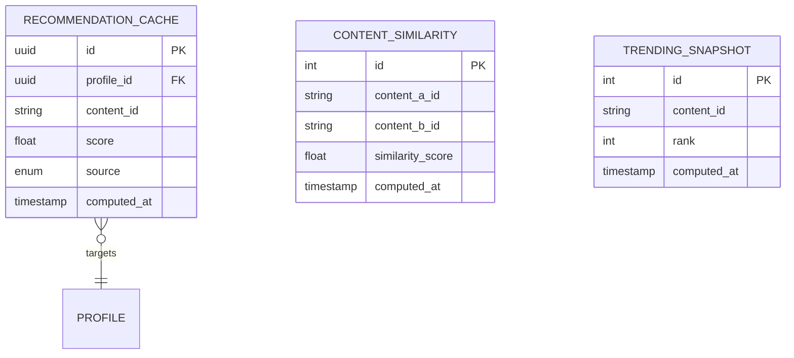

# 07 — Discovery Domain

## Rôle dans l'architecture

Discovery calcule et sert les suggestions de contenu. C'est le domaine qui dépend le plus des autres (il a besoin de données d'usage réelles de Delivery/Social pour être pertinent) — d'où sa place en dernière phase. C'est aussi le domaine le plus "recherche/algo" du projet, avec plusieurs niveaux de sophistication possibles.

## Concepts clés

### 1. Trois familles d'approches de recommandation

| Approche | Principe | Complexité | Pertinence pour ta spec |
|---|---|---|---|
| **Basée règles** | "Autres titres du même genre/acteur" | Faible | Bon point de départ, résultat correct |
| **Filtrage collaboratif** | "Les profils qui ont aimé X ont aussi aimé Y" | Moyenne | Correspond bien à "intérêts communs" |
| **Basée graphe social** | "Ce que tes contacts regardent/aiment" | Moyenne | Correspond exactement à "utilisateurs proches" |

Ta spec demande explicitement les deux derniers types. Pas besoin de deep learning/ML complexe pour un premier système correct — le filtrage collaboratif "classique" (similarité entre profils basée sur les réactions communes) est un algo bien documenté et un excellent exercice d'apprentissage en soi.

### 2. Filtrage collaboratif — item-based, la version la plus simple à commencer

Principe : pour un contenu A que le profil vient de regarder/aimer, trouver les contenus B les plus souvent aimés par les *autres* profils qui ont aussi aimé A.

```
score(A, B) = nombre de profils ayant aimé A ET B
            / nombre de profils ayant aimé A
```

Calculable en SQL pur au début (une requête avec self-join sur `Reaction`), pas besoin d'une lib ML pour la V1 — bon exercice de requêtes SQL avancées, dans la continuité directe de ton apprentissage DBMS.

### 3. Proximité sociale — exploiter le graphe `Connection`

"Suggestions aux utilisateurs proches" = propager les réactions du réseau social direct (`Connection` du domaine Social) :

```
score_social(titre) = poids × nombre de contacts suivis ayant aimé ce titre
```

Combinable avec le score collaboratif : score final = pondération des deux signaux.

### 4. Calcul batch vs temps réel

Calculer les recommandations à chaque requête (temps réel) devient coûteux si le volume de données grossit. Pattern standard : **précalcul périodique** (batch, ex: job nocturne) qui matérialise une table de recommandations par profil, servie ensuite en lecture simple.

```
Job planifié (ex: toutes les 6h) :
  1. Recalcule les scores de similarité entre contenus (collaborative filtering)
  2. Recalcule les scores basés sur le réseau social
  3. Matérialise top-N résultats par profil dans RecommendationCache
```

C'est un compromis classique fraîcheur vs coût de calcul — pertinent à documenter explicitement, dans la continuité des compromis que tu as déjà rencontrés (retry backoff, cache TTL).

### 5. Cold start — le vrai problème pratique

Un nouveau profil sans historique n'a ni réactions ni contacts avec historique → aucune recommandation calculable. Solution standard : **fallback vers popularité générale** (contenus les plus likés globalement, ou les plus regardés récemment) tant que le profil n'a pas assez de signal.

## Modèle de données

```
ContentSimilarity  (résultat précalculé du filtrage collaboratif)
- id (pk)
- content_a_id
- content_b_id
- similarity_score (float)
- computed_at

RecommendationCache  (matérialisation finale servie au client)
- id (uuid, pk)
- profile_id (fk -> Profile)
- content_id
- score (float)
- source (enum: collaborative, social, trending, fallback)
- computed_at

TrendingSnapshot  (fallback popularité générale, recalculé périodiquement)
- id (pk)
- content_id
- rank
- computed_at
```

Discovery ne stocke pas de nouvelles données "sources" — il lit `Reaction`/`WatchProgress`/`Connection` des autres domaines et matérialise ses propres résultats calculés.

## Schéma du modèle de données (ER)



## Contrat de service — gRPC

```protobuf
syntax = "proto3";
package discovery.v1;

service DiscoveryService {
  rpc GetRecommendations(GetRecommendationsRequest) returns (GetRecommendationsResponse);
  rpc TriggerRecompute(TriggerRecomputeRequest) returns (TriggerRecomputeResponse); // usage interne/admin
}

message GetRecommendationsRequest {
  string profile_id = 1;
  int32 limit = 2;
}

message GetRecommendationsResponse {
  repeated RecommendedContent items = 1;
}

message RecommendedContent {
  string content_id = 1;
  float score = 2;
  string source = 3; // "collaborative", "social", "trending"
}

message TriggerRecomputeRequest { string scope = 1; } // "similarity", "social", "trending", "all"
message TriggerRecomputeResponse { bool accepted = 1; }
```

## Bonnes pratiques

- **Toujours avoir un fallback** (trending) même quand le calcul principal échoue ou est vide — ne jamais renvoyer une liste vide à l'utilisateur si évitable
- **Explicabilité minimale** : garder `source` sur chaque recommandation, même si non affiché à l'utilisateur — indispensable pour débugger "pourquoi ce contenu m'a été suggéré" pendant le développement
- **Exclure le contenu déjà vu/complété** des recommandations (sauf logique volontaire de "re-suggestion" pour les séries en cours)
- **Isoler le calcul lourd du chemin de lecture** : `GetRecommendations` doit toujours lire une table déjà matérialisée (`RecommendationCache`), jamais recalculer à la volée dans le chemin critique d'affichage
- **Monitoring de la qualité** même basique : taux de clic sur les recommandations affichées (à logger dès le départ, même sans dashboard immédiat) — sans cette donnée, impossible de savoir si l'algo s'améliore

## État d'avancement

- [ ] Requête SQL de similarité item-based (collaborative filtering)
- [ ] Intégration du score social basé sur `Connection`
- [ ] Job de précalcul périodique + `RecommendationCache`
- [ ] Fallback trending pour cold start

## Fin de la série de specs de domaine

Les 7 domaines sont maintenant documentés (`01` à `07`). Prochaine étape : les guides d'implémentation `AGENT-BACKEND.md` et `AGENT-FRONTEND.md`.
