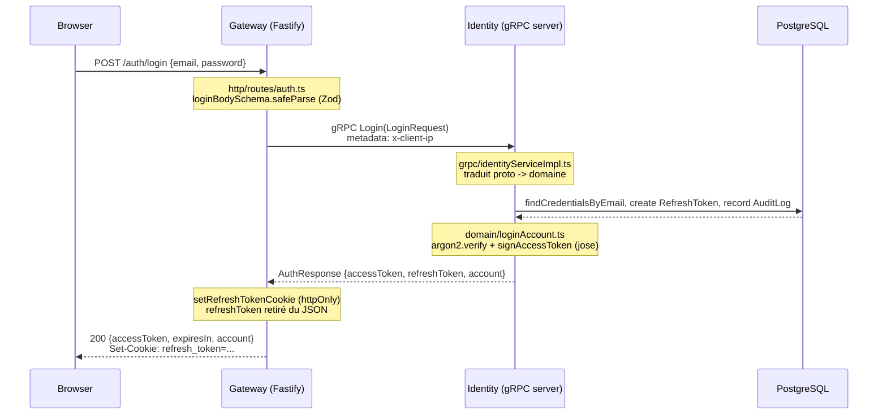

# ARCHITECTURE.md — Comment gRPC/REST/GraphQL s'articulent, et pourquoi ces packages

Ce document complète `00-OVERVIEW.md` (qui pose la règle) avec du concret : un parcours de requête réel à travers le code déjà écrit, et la justification des choix de librairies. À lire après `00-OVERVIEW.md` et avant de toucher à Identity ou à la Gateway.

## 1. Le principe (rappel de `00-OVERVIEW.md`)

| Qui parle à qui | Protocole | Pourquoi |
|---|---|---|
| Navigateur → Gateway | **REST** pour l'auth/compte, **GraphQL** pour le reste (Catalog/Social/Discovery, pas encore construits) | Voir `00-OVERVIEW.md`, "Les trois styles d'API" — en résumé, GraphQL gère mal les cookies `httpOnly` nécessaires au refresh token |
| Gateway → services internes (Identity, futur Billing/Catalog/...) | **gRPC**, toujours | Rapide, typé, jamais exposé au navigateur |

Point clé à ne pas perdre de vue : **le choix REST vs GraphQL ne concerne que la façade client de la Gateway**. En interne, tout passe par gRPC, sans exception. La Gateway ne contient aucune logique métier — elle valide la forme d'une requête, appelle un RPC, retraduit la réponse.

## 2. Un parcours réel : `POST /auth/login`

C'est le cas le plus complet actuellement implémenté (cookie + JWT + appel gRPC avec métadonnées). Suivre ce fil donne le patron pour n'importe quelle future route REST → gRPC.

**Fichiers exacts, dans l'ordre où la requête les traverse** :

1. `services/gateway/src/http/routes/auth.ts` — `fastify.post('/auth/login', ...)` : valide le corps avec `loginBodySchema` (Zod), *forme seulement*, pas de règle métier
2. `services/gateway/src/grpc/identityClient.ts` — `callUnary()` : promisifie l'appel gRPC, attache la métadonnée `x-client-ip` (IP réelle du navigateur, pas celle de la Gateway — voir `clientIpMetadata()`)
3. `proto/identity.proto` — contrat `rpc Login(LoginRequest) returns (AuthResponse)`, source de vérité partagée ; chaque service génère ses propres stubs TS via `ts-proto` (`npm run proto:gen`), pas de package de stubs partagé — décision volontaire, cf. §3
4. `services/identity/src/grpc/identityServiceImpl.ts` — `login()` : traduit `LoginRequest` (proto) en input domaine, lit `x-client-ip` via `grpc/clientIp.ts`
5. `services/identity/src/domain/loginAccount.ts` — logique métier pure : vérifie le mot de passe (argon2), le statut du compte, émet le JWT (`domain/tokens.ts`, lib `jose`) et le refresh token opaque
6. `services/identity/src/infra/prismaAccountRepository.ts` / `prismaRefreshTokenRepository.ts` / `prismaAuditLogRepository.ts` — seuls fichiers qui parlent à PostgreSQL, via Prisma
7. Retour : `identityServiceImpl.ts` reconstruit `AuthResponse`, la Gateway pose le cookie et renvoie le JSON

**Pourquoi passer par 3 couches (`grpc` → `domain` → `infra`) plutôt qu'un handler qui fait tout** : `domain/loginAccount.ts` ne connaît ni Prisma ni gRPC — il est testé en 5 lignes avec un repository en mémoire (`tests/unit/loginAccount.test.ts`), sans base de données. C'est l'architecture hexagonale décrite dans `services/AGENT.md` §3, appliquée concrètement.

### Mapping d'erreur, un seul endroit

Chaque route de la Gateway convertit un code gRPC en code HTTP via une unique fonction, `mapGrpcError()` (`services/gateway/src/http/routes/auth.ts`) :

| Code gRPC | Code HTTP | Exemple |
|---|---|---|
| `INVALID_ARGUMENT` | 400 | Email invalide, mot de passe trop court |
| `ALREADY_EXISTS` | 409 | Email déjà enregistré |
| `UNAUTHENTICATED` | 401 | Mauvais mot de passe, refresh token invalide/réutilisé |
| `FAILED_PRECONDITION` / `PERMISSION_DENIED` | 403 | Compte non vérifié / suspendu |
| `NOT_FOUND` | 404 | Compte inexistant |
| tout le reste | 500, message générique | Erreur interne — le détail est loggé serveur, jamais renvoyé au client (`services/AGENT.md` §8) |

Côté Identity, le mapping symétrique (erreur domaine → code gRPC) vit dans `services/identity/src/grpc/identityServiceImpl.ts`, fonction `toGrpcError()`.

## 3. Pourquoi chaque service génère ses propres stubs gRPC

`proto/identity.proto` est la seule source de vérité. Identity (serveur) et la Gateway (client) exécutent chacun leur propre `npm run proto:gen` (`protoc` + `ts-proto`) vers leur propre `src/grpc/generated/`, plutôt que de partager un package `@streaming/proto-generated`.

**Compromis assumé** : ça duplique la génération de code, mais ça garde chaque service déployable indépendamment sans dépendre d'un package interne à republier à chaque changement de contrat — cohérent avec le principe "chaque domaine est un service isolé" (`services/AGENT.md` §1.3). Le vrai contrat partagé reste le fichier `.proto` lui-même, versionné dans `/proto`.

## 4. Choix des packages — et pourquoi

### Backend commun à tous les services

| Package | Rôle | Pourquoi celui-ci |
|---|---|---|
| **TypeScript** | Langage | Déjà dans `services/AGENT.md` — typage statique partagé entre domain/infra/grpc |
| **`@grpc/grpc-js`** + **`ts-proto`** | Client/serveur gRPC + génération de types depuis `.proto` | `ts-proto` génère des interfaces TS lisibles (pas de `.d.ts` opaques) et un client/serveur typé bout-en-bout — cohérent avec `grpc-example/` déjà exploré |
| **Zod** | Validation d'entrée | Schémas déclaratifs, inférence de type TS automatique (`z.infer`), utilisé aux deux niveaux : validation de forme côté Gateway (`http/schemas.ts`) et validation métier côté Identity (`domain/schemas.ts`) — volontairement dupliqué, cf. "jamais de confiance implicite" (`services/AGENT.md` §7) |
| **Pino** (via `@streaming/shared-logging`) | Logging structuré | JSON natif, très performant, standard Node — un seul `createLogger(serviceName)` partagé pose `service_name` et la redaction des secrets (`password`, `token`, ...) une fois pour tous les services |
| **Vitest** + **Testcontainers** | Tests | Vitest : rapide, config TS native, déjà utilisé côté frontend exploré. Testcontainers : vrai PostgreSQL éphémère en test d'intégration — la règle du projet est "aucun mock de la base de données" (`services/AGENT.md` §4), donc pas d'alternative in-memory (ex: SQLite) acceptée ici |
| **`dotenv-cli`** | Charge le `.env` racine pour les commandes Prisma/`node dist/index.js` | Chaque service a son `package.json` dans un sous-dossier ; Prisma et Node ne remontent pas automatiquement chercher un `.env` dans un dossier parent — `dotenv-cli` pointe explicitement vers `../../.env` plutôt que de dupliquer le fichier par service |

### Spécifique à Identity

| Package | Rôle | Pourquoi celui-ci |
|---|---|---|
| **Prisma** (`@prisma/client` + `prisma`) | ORM + migrations | Voir §5 ci-dessous — comparé à Drizzle |
| **argon2** | Hash des mots de passe | Recommandé par `01-identity.md` : résiste mieux au craquage GPU/ASIC que bcrypt aujourd'hui. Utilisé uniquement pour les mots de passe (secrets à faible entropie choisis par l'utilisateur) |
| **jose** | Signature/vérification JWT (access tokens) | Implémentation JWT moderne, maintenue, API Promise-native ; pas de dépendance native à compiler (contrairement à certaines libs crypto) |
| **`node:crypto`** (`randomBytes` + `createHash('sha256')`, pas de package) | Génération/hash des tokens opaques (refresh token, token de vérification email) | SHA-256 et non argon2id pour ces tokens : ce sont des secrets à haute entropie générés par le serveur (256 bits aléatoires), pas des mots de passe — argon2id serait juste plus lent pour rien. Documenté dans `services/identity/src/domain/tokens.ts` |

### Spécifique à la Gateway

| Package | Rôle | Pourquoi celui-ci |
|---|---|---|
| **Fastify** | Serveur HTTP | Recommandé par `services/AGENT.md` — portera aussi GraphQL Yoga plus tard (Catalog/Social/Discovery) sans changer de socle HTTP |
| **`@fastify/cookie`** | Lecture/écriture du cookie `refresh_token` | Plugin officiel Fastify, gère `httpOnly`/`sameSite`/`path`/expiration nativement — pas besoin de parser les headers `Cookie`/`Set-Cookie` à la main |

## 5. Prisma vs Drizzle — pourquoi Prisma a été choisi

`services/AGENT.md` proposait initialement "Prisma ou Drizzle" sans trancher. Prisma a été retenu à l'usage pour ce projet, pour des raisons pragmatiques plutôt qu'un jugement absolu :

- **Migrations générées automatiquement** (`prisma migrate dev`) à partir du schéma déclaratif — pas de SQL à écrire à la main pour chaque évolution, ce qui compte vu le nombre de services à venir avec des schémas similaires (Catalog, Billing, ...)
- **Client généré fortement typé** sans configuration additionnelle (pas de plugin de build séparé)
- **Relations implicites lisibles** (`include: { studentVerification: true }`) qui collent bien au modèle Account/Profile/RefreshToken déjà dessiné dans `01-identity.md`
- Intégration directe avec Testcontainers dans nos tests (`new PrismaClient({ datasources: { db: { url } } })`, `prisma migrate deploy`) sans configuration supplémentaire

**Ce que Drizzle aurait apporté** (pour la prochaine fois qu'on hésite) : des requêtes plus proches du SQL brut, un démarrage à froid plus léger, moins de "magie" (pas de moteur Rust binaire séparé). Pour ce projet — orienté apprentissage + livraison rapide sur plusieurs services au schéma CRUD-heavy — la productivité de Prisma (migrations, Prisma Studio, DX) l'a emporté. Rien n'empêche un service futur (ex: `07-discovery` et ses requêtes de similarité, déjà noté comme cas particulier dans `01-identity.md`) d'utiliser Drizzle ou du SQL brut si Prisma devient trop limitant pour ce cas précis.

## 6. Ce qui n'est pas encore tranché

- **GraphQL Yoga** : choisi dans `services/AGENT.md` mais pas encore implémenté (aucun service GraphQL-facing n'existe — Catalog est la prochaine étape de la Phase 1)
- **BullMQ + Redis** : prévu pour `04-media-pipeline.md`, pas encore utilisé
- **MinIO** : infra déjà provisionnée (`docker-compose.yml`), pas encore de client S3 dans le code
